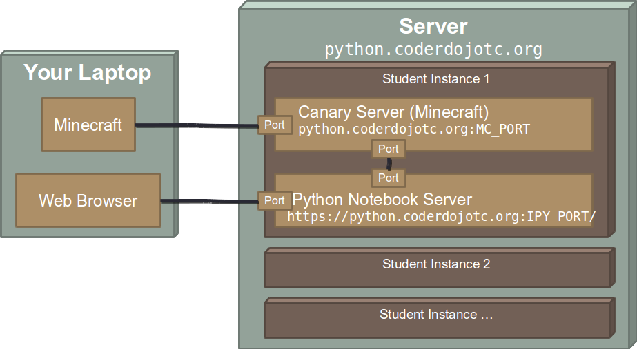
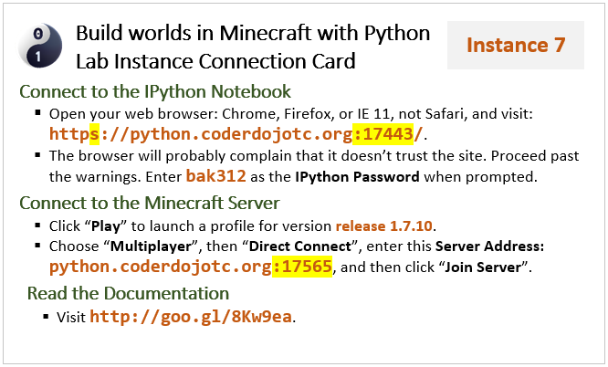
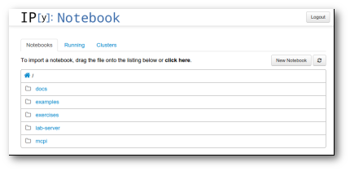

==============================
 Connect to Your Lab Instance
==============================

Once you are connected to :doc:`Wi-Fi <wifi>`, you need to turn your
attention to connecting your PC to the IPython Notebook and the
Minecraft world in your :term:`lab instance`. The diagram below
illustrates what sits where:

The :doc:`architecture guide <../reference/architecture>` explains a
bit more about the peices in this diagram.

Lab Instance Connection Card
============================

Your :term:`lab instance connection card` has all the critical
information, so make sure you have it in hand, and make sure the
Mentor who took your account name has had time to set up your instance
on the lab server. If so, you're ready to proceed.

The connection card looks something like the following:

Key information found on this card:

* Your Instance Number. In the upper right corner of the card is your
  Lab Instance Number. If you need to ask a mentor to restart your
  instance, they will need to know your instance number.

  .. note:: Too much TNT? A pyramid made out of beds or water? A
            restart can get you going again quickly.

* The IPython URL. It looks something like
  ``https://python.coderdojotc.org:12356/``. Many people miss the
  **S** in the ``https`` part of the URL. Many other people miss the
  numbers that follow the domain name. Both of these are critical to
  connect to your instance.

* The IPython password. When you first connect, you will be asked for
  a password to make sure only you can access the IPython notebook
  server in your instance.

* Your Minecraft/Mojang account name. This is printed on the line that
  reads "Step 3: Connect to the Minecraft Server as **coderdojo##**"
  This is the account you should use to log into the Minecraft
  world. Only this account will be able to make changes in your world.

* Your Minecraft server address. This looks very similar to the
  IPython URL, but it just contains the server name
  (``python.coderdojotc.org``) and a port number (the digits following
  the colon).

Connect to the IPython Notebook
===============================

The steps involved in connecting to IPython include:

#. Open your web browser. You need to use Chrome, Firefox, or IE 11 or
   newer. Safari is known to *not work*, at least on older Macs.

#. Visit the URL given on the connection card. The browser will
   probably complain that it doesn't trust the site. Proceed past the
   warnings.

#. Enter the IPython password when prompted.

You should see a screen like the one below:

Connect to the Minecraft Server
===============================

The steps involved in connecting to Minecraft include:

#. Launch Minecraft on your PC. If you haven't already installed and
   played Minecraft on your PC, visit the `Minecraft download page
   <https://minecraft.net/download>`_. Download and install the
   appropriate version for your operating system.

#. You will need to log into Minecraft. The account name is printed on
   the connection card. A mentor will need to log you in. If you are
   working through these exercises at home, use your personal
   Minecraft account.

#. Create a profile and make sure it uses version ``release 1.7.10``
   of the game. The image below illustrates what a properly configured
   profile will loook like:

   .. image:: _images/minecraft-profile.png

#. After saving the profile (if necessary), click :guilabel:`Play` to
   launch it.

#. Choose :guilabel:`Multiplayer`, then choose :guilabel:`Direct Connect`.

#. In the :guilabel:`Server Address` field, enter the Minecraft Server
   address from your connection card, including the port number at the
   end.

#. Finally, click :guilabel:`Join Server`. After a brief delay, you
   should see your Minecraft world.

Once you can talk to the IPython notebook server and the Minecraft
server, you need to make sure they can talk to each other. Continue on
to :doc:`test your environment <test>`.
